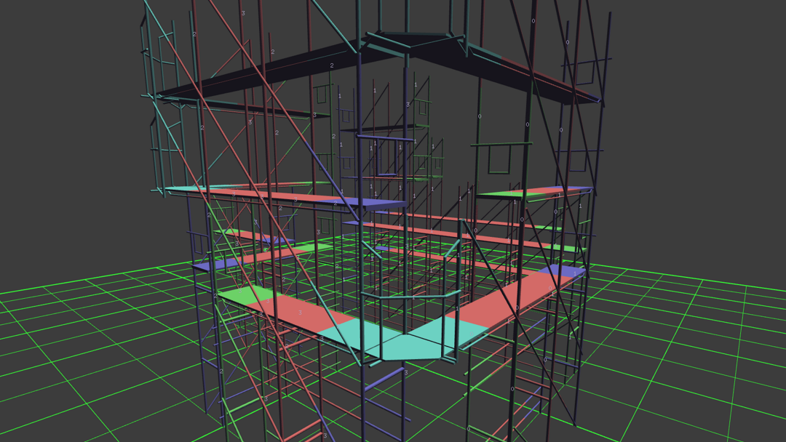
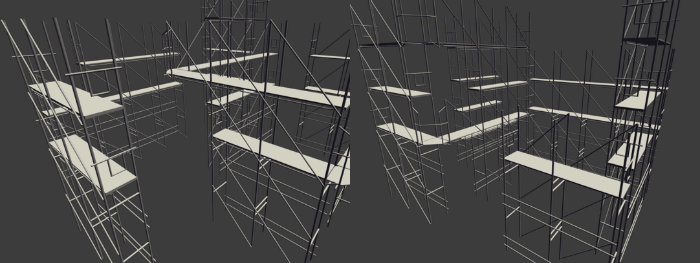
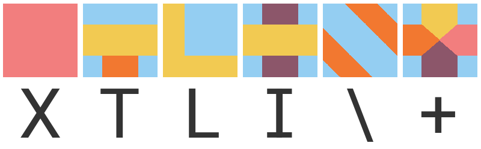

# Wave Function Collapse

A C++ implementation of the [Wave Function Collapse](https://github.com/mxgmn/WaveFunctionCollapse) **Tile-Model** algorithm by @[mxgmn](https://github.com/mxgmn) ready for OpenFrameworks.






### About

**ofxWFC3D** works in 3 dimensions, uses XML configuration files and outputs ofNode elements.

It supports the original symmetry, rotations and subsets. It also implements new functionalities.

**ofxWFC3D** does not require any specific hardware or external libraries and work in every OS.




### Usage

```c++
// instance the WFC3D
ofxWFC3D wfc;

// config_name, subset, x, y, z, periodic=false, ground_name="", surround_name=""
wfc.SetUp("data.xml", "default", width, height, length);

// run the WFC3D
// (the algorithm may runs into contradictions)
wfc.Run(seed);

// get a list of all the tiles transformations
ofNode world_node; // parent node
std::vector<ofNode> = wfc.getNodes(world_node, glm::vec3(size_x,size_y,size_z));

// get the indices of each tile based on the configuration
std::vector<size_t> modelIndices = wfc.getIndices();

```


#### Specific tiles instantiation

It reduces entropy and limits randomness creating predictable results.

```c++
// instanciate an specific tile on the WFC
wfc.SetTile("tile", x, y, z); 
```


### Special features

#### + symmetry

This version of the WFC, includes tiles without symmetry.
The "**+**" symmetry actually does not perform any symmetry, instead uses only rotations and has 4 unique anchor points.

For complex structures that require a very concrete tile union, use the symmetry type "**+**".

```xml
<tile name="corner" symmetry="+"/>
```


#### Height range

The "**min-height**" and "**max-height**"  attributes defined the height range where a tile can be placed.

```xml
<tile name="roof" symmetry="I" min-height="2" max-height="4"/>
```


### Performance

**Example basic** 

```javascript
// OF 0.10.1 - Arch-Linux | i7-6500U

| Process	| Microsecond   | Attempts  |
| ------------- | ------------- | --------- |
| SetUp		| 3204          | 1         |
| SetUp		| 1452          | 1         |
| SetUp		| 1438          | 1         |
| SetUp		| 451           | 1         |
| Run		| 140883        | 1         |
| Run		| 142980        | 1         |
| Run		| 134868        | 1         |
| Run		| 117848        | 1         |
```


**Example advance** 

```javascript
// OF 0.10.1 - Arch-Linux | i7-6500U

| Process	| Microsecond   | Attempts  |
| ------------- | ------------- | --------- |
| SetUp		| 2520          | 1         |
| SetUp		| 2025          | 1         |
| SetUp		| 1463          | 1         |
| SetUp		| 526           | 1         |
| Run		| 59608         | 3         | 2 contradictions
| Run		| 60894         | 4         | 3 contradictions
| Run		| 75666         | 3         | 2 contradictions
| Run		| 64881         | 1         |
| Run		| 69637         | 2         | 1 contradiction
```


## License

ofxWFC3D is distributed under the MIT License.
