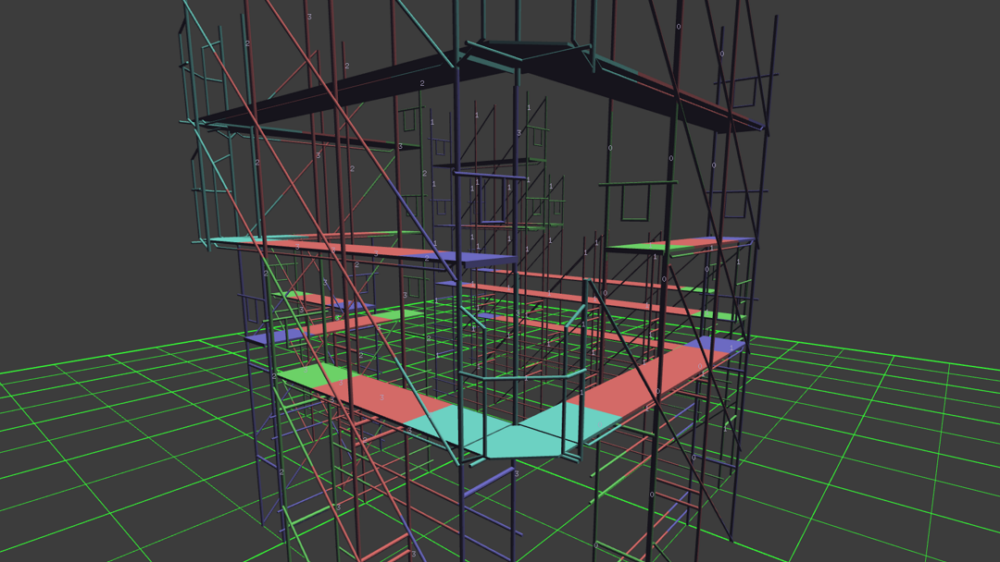
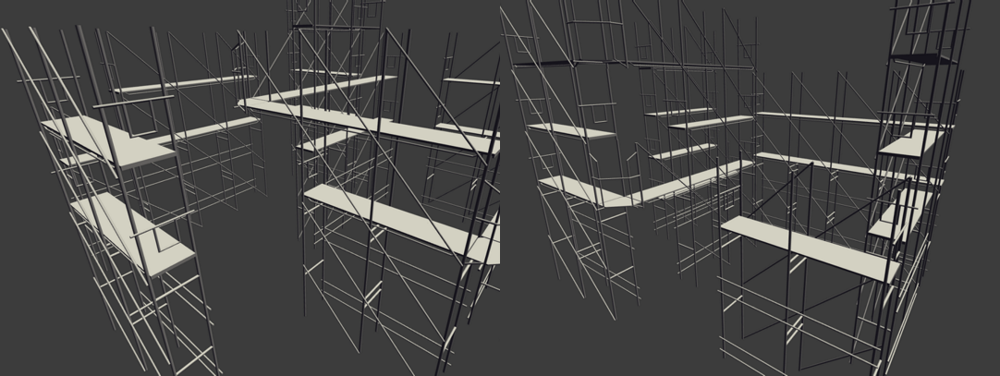
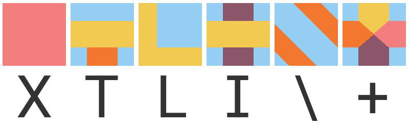
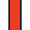

# Wave Function Collapse

A C++ implementation of the [Wave Function Collapse](https://github.com/mxgmn/WaveFunctionCollapse) **Tile-Model** algorithm by @[mxgmn](https://github.com/mxgmn) ready for OpenFrameworks.






### About

**ofxWFC3D** works in 3 dimensions, uses XML configuration files and outputs multiple formats such indices, ofNodes and key-value transformation tables.

It supports the original symmetry, rotations and subsets. It also implements new functionalities. The addon does not require any specific hardware or external libraries. It should work in every OF supported platform.


#### symmetry

#### 


#### cardinality

The tiles placement and their neighbor relations are based its symmetry.
Tiles rotates **anticlockwise** *90°* on the **Y** axis.

| symmetry |                           0 \| 0°                            |                           1 \| 90°                           |                          2 \| 180°                           |                          3 \| 270°                           |
| -------- | :----------------------------------------------------------: | :----------------------------------------------------------: | :----------------------------------------------------------: | :----------------------------------------------------------: |
| **X**    |  |                              x                               |                              x                               |                              x                               |
| **T**    |  |  |  |  |
| **L**    |  |  |  |  |
| **I**    |  |  |                              x                               |                              x                               |
| **\\**   |  |  |                              x                               |                              x                               |
| **+**    |  |  |  |  |


### Usage

```c++
// instance the WFC3D
ofxWFC3D wfc;

// config_name, subset, x, y, z, periodic=false, ground_name="", surround_name=""
wfc.SetUp("data.xml", "default", width, height, length);

// run the WFC3D
// (the algorithm may runs into contradictions)
wfc.Run(seed);

// get a list of all the tiles transformations
ofNode world_node; // parent node
std::vector<ofNode> = wfc.getNodes(world_node, glm::vec3(size_x,size_y,size_z));

// get the indices of each tile based on the configuration
std::vector<size_t> modelIndices = wfc.getIndices();

```


#### Specific tiles instantiation

It reduces entropy and limits randomness creating predictable results.

```c++
// instanciate an specific tile on the WFC
wfc.SetTile("tile", x, y, z); 
```


### Special features

#### + symmetry

This version of the WFC, includes tiles without symmetry.
The "**+**" symmetry actually does not perform any symmetry, instead uses only rotations and has 4 unique anchor points.

For complex structures that require a very concrete tile union, use the symmetry type "**+**".

```xml
<tile name="corner" symmetry="+"/>
```


#### Height range

The "**min-height**" and "**max-height**"  attributes defined the height range where a tile can be placed.

```xml
<tile name="roof" symmetry="I" min-height="2" max-height="4"/>
```


#### Axis and coordinate origin

**ofxWFC3D** has a different axis coordinate, being Y-up and Z-forward. That is what OF uses as well. This changes does not only changes the output, it does also affects the configuration and the way the wave propagates and its observed.


### Performance

#### Optimizations

Three algorithmic optimizations reduce Run() time by **59-114x**:

1. **Queue-based propagation** -- replaces full-grid scan with a worklist queue. Only processes voxels that actually changed. O(V) per pass to O(changed).
2. **Bitset compatibility masks** -- precomputes `uint64_t` bitmasks for pattern compatibility. Replaces the inner pattern loop with a single bitwise AND (when patterns <= 64).
3. **Entropy cache** -- caches Shannon entropy, weight sums, and pattern counts per voxel using flat `std::vector`. Observe() reads cached values in O(1) per cell instead of recalculating from all patterns. Propagate() updates the cache incrementally when eliminating patterns.

#### Benchmarks

**Example basic** -- 8x4x8 grid, 16 patterns

```
// OF 0.12.1 - Arch-Linux | Ryzen 9 5900HX | n=44 runs

| Process | Avg (us) | Min (us) | Max (us) |
| ------- | -------- | -------- | -------- |
| SetUp   |      407 |      271 |      496 |
| Run     |     1175 |      976 |     1492 |
```

**Example advance** -- 9x5x9 grid, 29 patterns, surround constraint

```
// OF 0.12.1 - Arch-Linux | Ryzen 9 5900HX | n=60 successful runs

| Process | Avg (us) | Min (us) | Max (us) |
| ------- | -------- | -------- | -------- |
| SetUp   |      552 |      401 |      703 |
| Run     |     1120 |      858 |     1676 |
```

#### Comparison with original (unoptimized)

```
// OF 0.10.1 - Arch-Linux | i7-6500U (original, unoptimized)

| Example  | Original Run (us) | Optimized Run (us) | Speedup |
| -------- | ----------------- | ------------------ | ------- |
| basic    |          ~134,000 |              1,175 |   114x  |
| advance  |           ~66,000 |              1,120 |    59x  |
```

*Full disclosure: Optimization techniques implemented with the support of AI (Claude Code)*


## License

ofxWFC3D is distributed under the MIT License.
